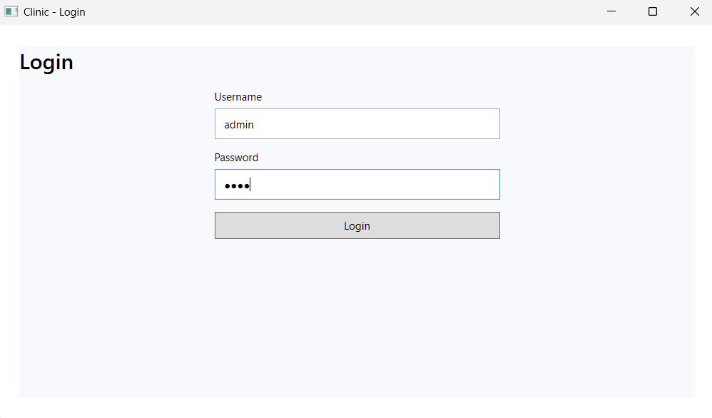
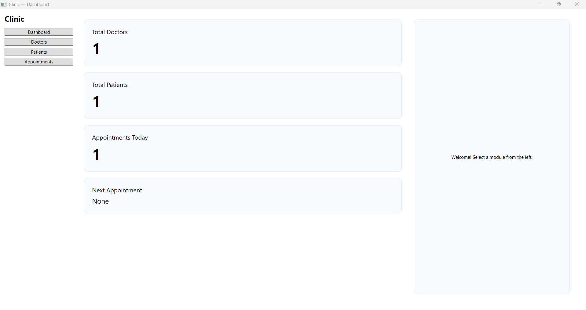
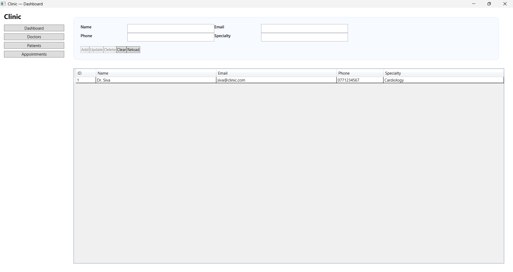
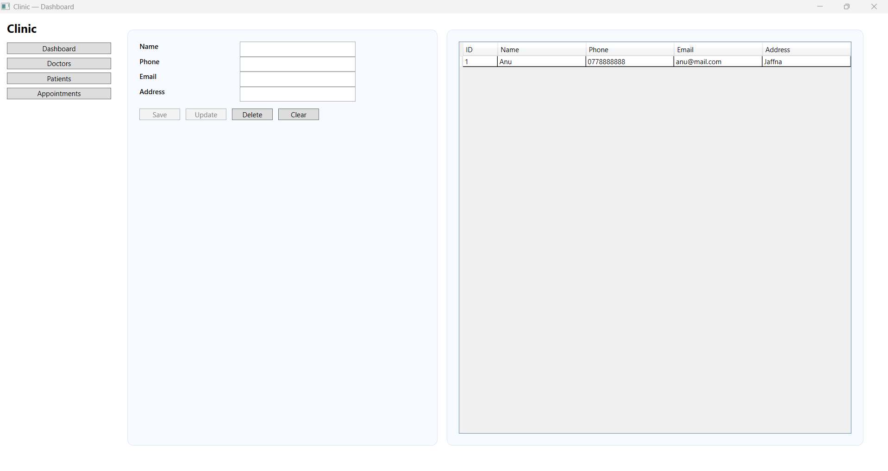
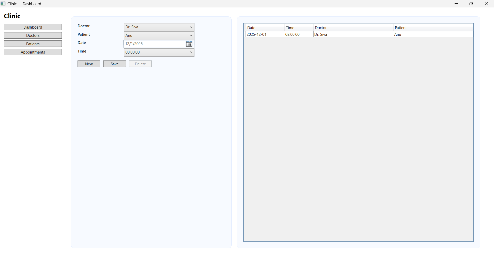

# 🏥 Clinic Appointment Management System (WPF, .NET 8)

A **desktop-based clinic appointment management system** built using **C#, .NET 8, and WPF (MVVM)**.  
This system allows a clinic admin to manage **doctors, patients, and appointments** with a clean dashboard UI.

---

## 👩‍🎓 Project Info

- **Student:** Poojah Yogarasa  
- **Index No:** E2410780  
- **Module:** ITE 1943 – ICT Project (BIT – University of Moratuwa)  
- **Type:** Desktop Application (WPF, .NET 8, MVVM)  

---

## ✨ Features

### 🔐 Authentication
- Simple **admin login** to access the system.
- Prevents unauthorized access to clinic data.

### 👨‍⚕️ Doctor Management
- Add, edit, and delete doctor records.
- Fields include: name, specialization, phone, availability, etc.

### 🧑‍🤝‍🧑 Patient Management
- Register new patients with basic details.
- Edit or remove existing patient records.

### 📅 Appointment Management
- Create appointments by selecting:
  - Doctor
  - Patient
  - Date
  - Time slot
- View all upcoming appointments.
- Prevents overlapping scheduling (basic validation).

### 📊 Dashboard Overview
- Total number of **doctors**
- Total number of **patients**
- Number of **appointments for today**
- **Next upcoming appointment** summary

---

## 🛠️ Tech Stack

- **Framework:** .NET 8 (Windows Desktop)
- **UI:** WPF (Windows Presentation Foundation)
- **Pattern:** MVVM (Model–View–ViewModel)
- **Language:** C#
- **Architecture:** Layered (App, Domain, Infrastructure)
- **Data Storage:** In-memory (services can later be redirected to a real database)
- **Build Type:** Release | Any CPU

---

## 🧱 Project Architecture

The solution is split into three main projects:

- **Clinic.App**
  - WPF UI (Views)
  - ViewModels (MVVM)
  - In-memory services for Doctors, Patients, Appointments
  - RelayCommand & helpers

- **Clinic.Domain**
  - Core entities: `Doctor`, `Patient`, `Appointment`, `User`
  - Domain interfaces for services

- **Clinic.Infrastructure**
  - (Optional / Extension) – contains EF Core-based services and database context (if used)

---

## 📁 Folder Structure

```text
ClinicAppointmentSystem/
│
├── Source_Code/
│   ├── Clinic.App/
│   │   ├── Views/            # Login, Dashboard, Doctors, Patients, Appointments
│   │   ├── ViewModels/       # MainViewModel, LoginViewModel, DashboardViewModel, etc.
│   │   ├── Services/         # InMemoryDoctorService, InMemoryPatientService, InMemoryAppointmentService
│   │   ├── Infrastructure/   # RelayCommand, helpers
│   │   ├── App.xaml
│   │   ├── MainWindow.xaml
│   │   └── Clinic.App.csproj
│   │
│   ├── Clinic.Domain/
│   │   ├── Entities/
│   │   ├── Interfaces/
│   │   └── Clinic.Domain.csproj
│   │
│   ├── Clinic.Infrastructure/
│   │   ├── Data/
│   │   ├── Services/
│   │   └── Clinic.Infrastructure.csproj
│   │
│   └── Clinic.App.sln        # Solution file
│
├── Publish_Output/           # Ready-to-run build (for examiner/client)
│   ├── Clinic.App.exe
│   └── (required DLLs & runtimes)
│
└── README.md

````
---
## 🚀 How to Run (Source Code – Developer Mode)

1. Open **Visual Studio 2022** (or any version that supports .NET 8).
2. Click **Open a project or solution**.
3. Navigate to: Source_Code/Clinic.App/Clinic.App.sln
4. Wait for all NuGet packages to restore automatically.
5. In Solution Explorer, right-click **Clinic.App** → select **Set as Startup Project** (if not already set).
6. Click **Build → Rebuild Solution** to ensure everything compiles correctly.
7. Press **F5** or click **Start (▶)** to run the application.
8. The Clinic Appointment Dashboard will open.

---
## 🧪 How to Run (Publish Output – Without Visual Studio)

This method is for examiners, lecturers, or users who want to run the application **without installing Visual Studio**.

1. Open the folder: Publish_Output
  
2. Make sure the PC has **.NET 8 Desktop Runtime** installed.  
(Download from: https://dotnet.microsoft.com/en-us/download/dotnet/8.0)

4. Locate the executable file: Clinic.App.exe

5. Double-click **Clinic.App.exe** to launch the desktop application.

6. The system will open with the **Login screen**.

---

## 🔑 Login Details

Use the following credentials to access the system:

- **Username:** `admin`
- **Password:** `1234`

These values can be modified in the authentication logic if needed.

---

## 📸 Screenshots

Below are the main screens of the **Clinic Appointment Management System**.

| Screen | Description | Preview |
|--------|-------------|----------|
| **Login Page** | Secure admin login interface. |  |
| **Dashboard** | Overview of doctors, patients, and today's appointments. |  |
| **Doctors Management** | Add, edit, delete doctor information. |  |
| **Patients Management** | Register new patients and manage their records. |  |
| **Appointments Management** | Schedule, view, and manage appointments. |  |

---

## 🌱 Future Enhancements

These features can be added in future versions to improve functionality and user experience:

### 🔧 Functional Enhancements
- Integrate a **real database** (SQLite, SQL Server, MySQL) instead of in-memory storage.
- Add **role-based login** (Admin, Doctor, Receptionist).
- Implement **search and filtering** for doctors, patients, and appointments.
- Add **appointment conflict detection** with detailed validation.
- Enable **email/SMS notifications** for upcoming appointments.

### 🎨 UI / UX Improvements
- Add dark mode support.
- Improve styling with modern WPF components and animations.
- Add loading indicators and toast notifications.

### 📊 Reporting & Analytics
- Generate downloadable **PDF / Excel reports** for daily appointments.
- Add appointment statistics and charts.

### 🛡 Security Enhancements
- Encrypt user credentials.
- Add authentication tokens for advanced security.

### 🌐 Deployment
- Provide auto-updating installer (ClickOnce / MSIX packaging).
- Cloud-synced database for multiple-machine access.

---

## 🎥 Demonstration Video

A complete demonstration of the **Clinic Appointment Management System** is available in the link below:

🔗 **Watch Full Demo:** [https://drive.google.com/file/d/your-video-id/view](https://drive.google.com/file/d/1U7G-JtXb3Bjk2i1Axd8M4RpL0Rflas30/view?usp=sharing)

This video covers:
- Login authentication  
- Dashboard overview  
- Doctor management  
- Patient management  
- Appointment scheduling  
- UI interactions and validations  

---


